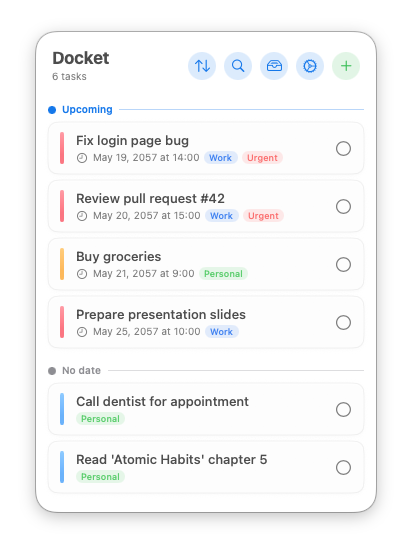
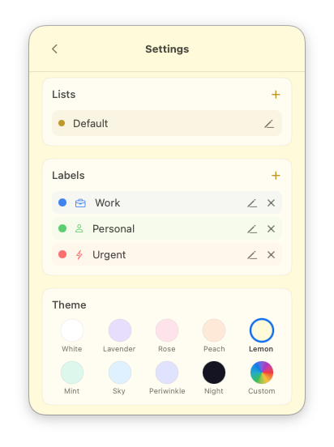

<p align="center">
  
</p>

<p align="center">
  <strong>A beautiful, minimal task manager that lives in your macOS menu bar.</strong><br>
  Integrates with Apple Reminders — iCloud, Siri, and Apple Watch support out of the box.<br>
  No dock icon. No clutter. Just click the ✓ and get things done.
</p>

<p align="center">
  
  
  
  
  
</p>

<p align="center">
  
  &nbsp;
  
  &nbsp;
</p>

---

## ✨ Features

<table>
<tr>
<td>

`🎯 Tasks`
- Create, edit, complete, delete
- Priority levels (pastel color-coded)
- Swipe right → complete, left → delete
- Long-press & drag to reorder
- Undo toast on complete/delete (3s)

</td>
<td>

`⏰ Reminders`
- Optional due dates with calendar picker
- Smart notifications before deadline
- Configurable: 5min → 1 day before
- Natural language: "tomorrow 3pm"
- Relative labels: "Today 3pm", "Friday"

</td>
</tr>
<tr>
<td>

`⌨️ Power User`
- Global hotkey (⌘⇧D, configurable)
- Quick-add: double-press to create
- ⌘N new task, Esc to go back
- Right-click context menu
- Export/import tasks as JSON

</td>
<td>

`🎨 Themes`
- 9 built-in + custom color picker
- Accent-colored UI throughout
- Dark mode (Night theme)
- Hue & intensity sliders for custom
- **Liquid Glass** mode (macOS 26)
- Toggle between glass and solid

</td>
</tr>
<tr>
<td>

`📋 Organization`
- Multiple lists with their own color
- Labels with color + icon (per list)
- 20-color palette + custom hex via system color panel
- Unified picker across lists, labels, and matrix
- Sort: custom order, by due date, or by priority
- Filter by label in sort bar
- Grouped: Overdue / Today / Upcoming
- Search with real-time filtering
- Badge count for due tasks

</td>
<td>

`✨ Delight`
- Confetti on task completion
- Hover effects on cards
- Smooth animations everywhere
- Custom calendar & time pickers
- First-launch onboarding

</td>
</tr>
<tr>
<td>

`🔄 Reminders Sync`
- Two-way sync with Apple Reminders
- iCloud sync across all devices — free
- Siri & Apple Watch support
- Pick which Reminders lists to sync
- Auto-creates "Docket" list in Reminders
- Conflict resolution (last-write-wins)

</td>
<td>

`🔁 Recurring Tasks`
- Daily, weekly, or monthly repeat
- Configurable interval (every N days/weeks/months)
- Auto-creates next task on completion
- Frequency shown on task cards

</td>
</tr>
<tr>
<td>

`📊 Eisenhower Matrix`
- Visual 2×2 priority matrix
- Free-position tasks by dragging
- Drag between quadrants to re-categorize
- Customizable colors, labels, and layout

</td>
<td>

`☕ Tip Jar`
- Leave an optional tip if you enjoy Docket
- ☕ / 🍕 / 🎉 — one-time, no subscriptions
- StoreKit 2 consumables; nothing tracked
- Open from Settings or the right-click menu

</td>
</tr>
</table>

---

## 🚀 Quick Start

```bash
# Build
./build.sh

# Run
open build/Docket.app

# Install permanently
cp -r build/Docket.app /Applications/
```

> **Requirements:** macOS 14+ and Xcode Command Line Tools (`xcode-select --install`)

---

## ⌨️ Keyboard Shortcuts

| Shortcut | Action |
|----------|--------|
| `⌘⇧D` | Toggle Docket (configurable) |
| `⌘⇧D` × 2 | Quick-add: jump to new task |
| `⌘N` | New task (popover open) |
| `Esc` | Go back |
| Right-click icon | Context menu |

---

## 📅 Smart Dates

Type natural language in the due date field:

| Input | Parsed as |
|-------|-----------|
| `today` / `eod` | Today 5:00 PM |
| `tonight` | Today 9:00 PM |
| `noon` | Today 12:00 PM |
| `this afternoon` | Today 2:00 PM |
| `later` | 3 hours from now |
| `tomorrow 3pm` | Tomorrow 3:00 PM |
| `day after tomorrow` | +2 days 9:00 AM |
| `next friday` | Next Friday 9:00 AM |
| `monday 9:30am` | Next Monday 9:30 AM |
| `in 2 hours` | 2 hours from now |
| `in 3 days` | 3 days from now |
| `this weekend` | Saturday 10:00 AM |
| `next week` | Next Monday 9:00 AM |
| `end of week` / `eow` | Friday 5:00 PM |

---

## 🔄 Reminders Integration

Docket syncs bidirectionally with Apple Reminders — giving you **iCloud sync, Siri, and Apple Watch** for free.

**How it works:**
1. Toggle "Sync with Reminders" in Settings
2. Docket creates a "Docket" list in Apple Reminders (or links to an existing one)
3. All tasks push to Reminders automatically
4. Changes made in Reminders (or via Siri/Watch) pull back into Docket

**What syncs:**

| ✅ Synced | ❌ Docket-only |
|-----------|---------------|
| Title, notes | Labels |
| Due date | Sort order |
| Priority | Custom themes |
| Completion status | |
| Recurrence rules | |

**Multi-list sync:** You can pick additional Reminders lists to sync — each maps to a Docket list. Tasks flow both ways.

**Conflict resolution:** Last-modified-date wins. If you edit a task in both Docket and Reminders between syncs, the most recent change is kept.

---

## 🎨 Themes

| Light | Dark | Custom | Glass |
|-------|------|--------|-------|
| White, Lavender, Rose, Peach, Lemon, Mint, Sky, Periwinkle | Night | Any color via hue + intensity | Liquid Glass on/off |

All UI elements — buttons, toggles, pills, calendar, toast — adapt to the theme's accent color. With Liquid Glass enabled, the system translucent material shows through with a subtle theme tint.

---

## 🏗 Architecture

```
Docket/
├── DocketApp.swift                 # App entry, menu bar, hotkey, context menu
├── Models/
│   ├── TodoItem.swift              # Task model (Codable, backward-compatible)
│   ├── TaskList.swift              # List/project model + DocketExport
│   ├── TaskLabel.swift             # Label model with color + icon
│   ├── ReminderOffset.swift        # Notification timing options
│   ├── AppTheme.swift              # 9 themes + custom + ThemeManager
│   ├── SortMode.swift              # Custom, By Due Date, By Priority
│   └── Strings.swift               # L10n localization strings
├── Services/
│   ├── Store.swift                 # JSON persistence, CRUD, lists, labels, reorder
│   ├── NotificationManager.swift   # UNUserNotifications scheduling
│   ├── RemindersSync.swift         # Two-way Apple Reminders sync (EventKit)
│   ├── TipJar.swift                # Optional tips via StoreKit 2 (consumables)
│   ├── DateParser.swift            # Natural language → Date parsing
│   └── DueDateFormatter.swift      # Relative date display formatting
└── Views/
    ├── ContentView.swift           # Router, theme, onboarding, keyboard nav
    ├── TaskListView.swift          # Main list, sort bar, label filter, undo toast
    ├── TaskRowView.swift           # Task card with priority bar + labels
    ├── SwipeableTaskRow.swift      # Swipe gestures + long-press drag reorder
    ├── ConfettiView.swift          # Completion celebration
    ├── UndoToast.swift             # Undo notification toast
    ├── CalendarPickerView.swift    # Custom themed calendar
    ├── TimePickerView.swift        # Custom themed time selector
    ├── ReminderPickerView.swift    # Themed reminder dropdown
    ├── PriorityPickerView.swift    # Colored priority pills
    ├── LabelPickerView.swift       # Multi-select label pills
    ├── ThemedToggle.swift          # Custom accent toggle switch
    ├── CreateTaskView.swift        # New task + smart dates + labels
    ├── TaskDetailView.swift        # Edit task + reminders + labels
    ├── CompletedTasksView.swift    # Done tasks with restore
    ├── SettingsView.swift          # Preferences + lists + labels + export
    ├── TipJarView.swift            # Optional tips UI (StoreKit 2)
    └── OnboardingView.swift        # First-launch guide
```

### Design Decisions

| Decision | Rationale |
|----------|-----------|
| JSON file, not SwiftData | Builds with `swiftc` alone — no Xcode.app needed |
| No Dock icon | `LSUIElement = true` — stays out of the way |
| Popover, not window | Dismisses on click-outside, feels native |
| Custom pickers & toggles | Native controls don't respect themes |
| Carbon hotkey API | Only way to register global shortcuts on macOS |
| `@Observable` Store | Single source of truth, reactive UI updates |
| Separate tap/swipe targets | Prevents gesture conflicts in popover |

### Tech Stack

| Layer | Technology |
|-------|-----------|
| UI | SwiftUI |
| App Lifecycle | AppKit (NSStatusItem, NSPopover) |
| Persistence | JSON → Application Support |
| Notifications | UserNotifications |
| Reminders Sync | EventKit |
| Global Hotkey | Carbon HIToolbox |
| Launch at Login | ServiceManagement |
| Build | Single `swiftc` invocation |

---

## 📦 Data

Tasks, lists, and labels are stored at:
```
~/Library/Application Support/Docket/
├── tasks.json
├── lists.json
└── labels.json
```

Settings use `UserDefaults` (standard macOS preferences).

---

## 🔒 Permissions

| Permission | Why | When |
|-----------|-----|------|
| Notifications | Task reminders | First launch |
| Accessibility | Global keyboard shortcut | When using hotkey |
| Reminders | Two-way sync with Apple Reminders | When enabling sync |

---

## 📄 License

MIT — see [LICENSE](LICENSE)

---

<p align="center">
  Made with ☕ by <a href="https://github.com/santoru">@santoru</a>
</p>
